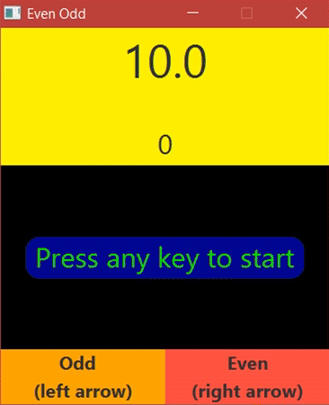

# Even or Odd Game
## **[Download Latest Release](https://github.com/SleekPanther/even-odd-game/releases/latest)**
## What is it?
A recreation of a simple Andoid app I liked and wanted to code myself  
[Original Android App](https://play.google.com/store/apps/details?id=com.tamaleh.app)

### Demo

- A random number appears & the you must identify if it's Even or Odd. (It's really that simple)
- You get 10 seconds when the game starts to correctly identify as many as possible
- 10 Seconds is added to your Time Remaining for every 10 correct
- The game ends immediately when you guess wrong or run out of time

## How to Play
***You will need Java to run the game:*** **[Download java](https://java.com/en/download/)**

### **[Download Latest Release (same link as above)](https://github.com/SleekPanther/even-odd-game/releases/latest)**

### Important Notes for High Scores
- **When you download an updated version of the game, simply overwrite or delete the old `EvenOdd.jar` file**
- **Saving `EvenOdd.jar` in a new location will reset your high score**
- **Moving the existing `EvenOdd.jar` file will also reset your score**

## Controls (Keyboard)
- Any key to start
- `Left arrow` is Odd
- `Right arrow` is Even
- `SPACE` restarts the game when it's over
